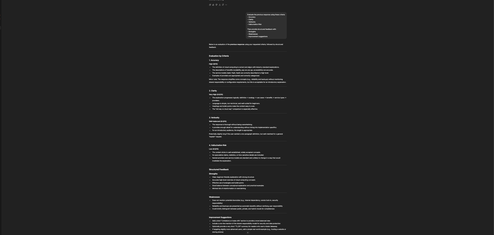
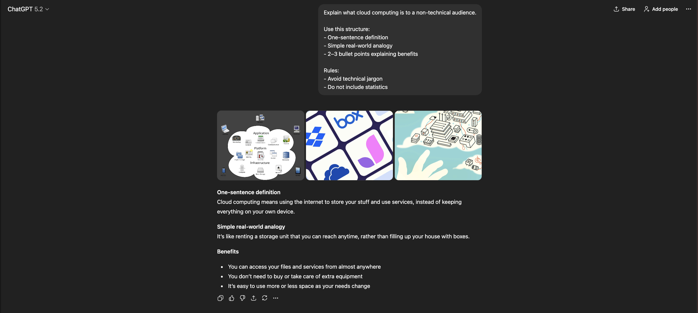

# Prompt Optimization System

## Overview
This project demonstrates a systematic approach to improving prompts
using structured evaluation and feedback loops.

The focus is on:
- Measuring prompt quality
- Reducing hallucinations
- Improving clarity and consistency
- Iterative prompt refinement

## Optimization Workflow
1. Run original prompt
2. Evaluate output using defined criteria
3. Collect structured feedback
4. Generate improved prompt versions
5. Compare before vs after results

## Examples

### Original Prompt Output

### Structured Feedback

### Optimized Prompt v1 Output

### Optimized Prompt v2 Output

## Why This Matters
Prompt quality improves through iteration, not intuition.
This project shows how prompt engineering can be treated
as an optimization problem with measurable improvements.
